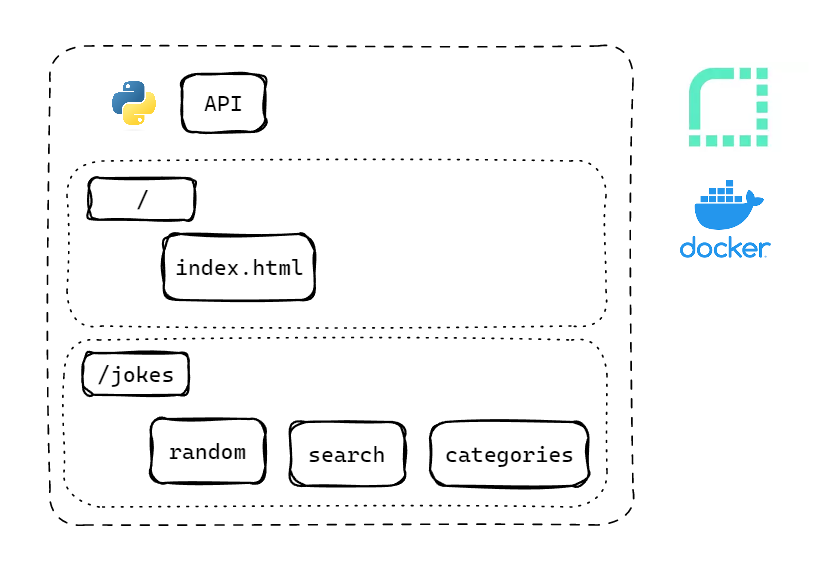

## Chuck Norris API

---

### Sessões do Projeto

- [1. Introdução](#1-introdução)
- [2. Estratégia de Solução](#2-estratégia-de-solução)
- [3. Desenvolvimento](#3-desenvolvimento)
- [4. Próximos Passos](#4-próximos-passos)
- [5. Referências](#5-referências)

---

### 1. Introdução
---

O projeto `c-api` tem por principal finalidade estudar e criar uma api utilizando o Python como ferramenta. Como meio de referência e estudos, foi utilizando a API original do Chuck Norris, disponível neste link: [Chuck Norris API](https://api.chucknorris.io/).

A Api tem como objetivo duplicar as funcionalidades da API original com o intuito de estudar os endpoitns e também o micro framework `Starlette` que com ele desenvolvemos a solução completa similar a solução original, que inclusive a versão original está no github neste link: [Chuck Norris Github](https://github.com/chucknorris-io). 

O projeto foi desenvolvido utilizando o próprio Python como ferramenta e diversas bibliotecas / frameworks do Python. Após o desenvolvimento foi colocado em produção utilizando Docker e a Cloud Render.

### 2. Estratégia de Solução
---

Como esta descrito na imagem abaixo, a API vai possuir alguns endpoitns baseados na API do chuck norris original e o deploy foi realizado no Render.

**Planejamento.**

**Entrega do Produto.**

- Uma API online onde o usuário consegue obter suas piadas. 
- Link e uma documentação para acessar a API. 
- Disponível Online.

**Processo.**

- Definição do formato de entrega;
- Definição da Infraestrutura;
- Definição da Base de Dados;
- Coleta de todos os dados necessários;
- Elaboração da API e três diferentes endpoints.
- Lista de todas as Categorias de Piadas;
- Uma Piada Aleatória;
- Uma Piada dado uma determinada categoria;
- Uma Pesquisa por uma Piada;
- Lista de Categorias de Piadas.

**Fonte e Ferramentas.**

- Ferramentas: Python, biblioteca Starlette / FastAPI.
- Fontes de dados: Webscraping / Bases de piadas públicas.

### 3. Desenvolvimento
---

O desenvolvimento foi efetivamente clonar a API do chuck norris para fins de estudo agora com a ferramenta Python.

A primeira etapa do desenvolvimento foi efetivamente foi desenvolver o planejamento, a insfraestrutura e a base de dados que vai ser consumida pela aplicação, depois as devidas inserções na base de dados dos dados necessários das piadas, então a api irá coletar esses dados da base e responder para os devidos endpoints.

Após a definição da base de dados e dos dados, foi iniciado o desenvolvimento dos endpoints da solução, a api consiste do endpoint home (/) que retorna o html da página do chuck api e também os endpoints para a coleta dos dados.

Com a aplicação já funcionando localmente foi simulado um ambiente com Docker de deploy para assim efetivamente colocar em produção com o Render.

### 4. Próximos Passos
---

Para os proximos passos, consiste em algumas correções.

- [ ] Mudar a Base de Dados (para uma base na cloud).
- [ ] Inserir mais dados de Piadas para incrementar a solução.

### 5. Referências
---

[1] [Chuck Norris API](https://api.chucknorris.io/): Api Original.

[2] [Starlette Docs](https://www.starlette.io/): Documentações do Framework Starlette.